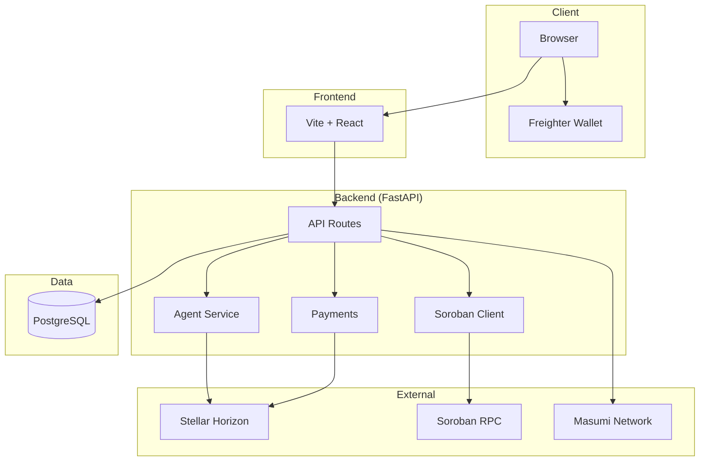
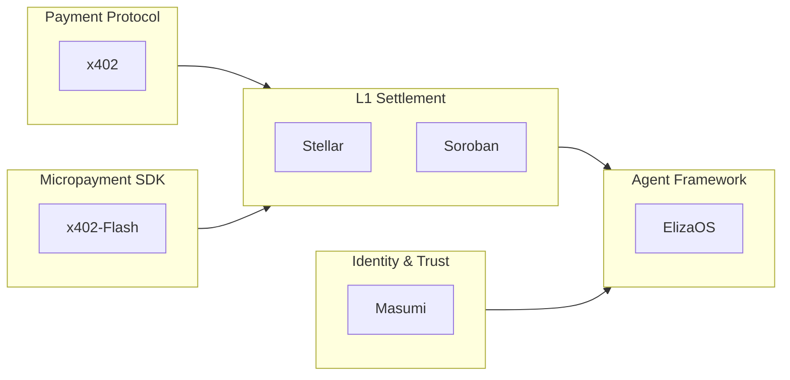
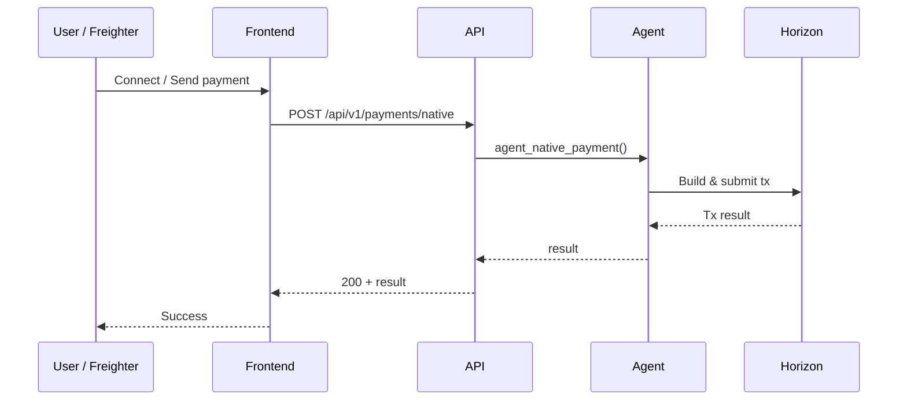

# Project Cygnus

**Machine Economy: Autonomous Agents and Programmable Payments on the Stellar Blockchain.**

| Layer | Technology | Role |
|-------|------------|------|
| Settlement (L1) | Stellar / Soroban | Ledger, settlement, escrow |
| Agent Framework | ElizaOS | Multi-agent logic & memory |
| Payment Protocol | x402 | HTTP 402 Payment Required |
| Micropayment SDK | x402-Flash Stellar SDK | Off-chain channels (<100ms) |
| Identity & Trust | Masumi Network | DIDs, decision logging, marketplace |

---

## Architecture

### System overview



### Five-layer stack



### Request flow (payments)



---

## Folder structure

```
Project_Cygnus/
├── README.md
├── PROJECT_PLAN.md
├── pyproject.toml
├── requirements.txt
├── environment.yml
├── .env.example
├── alembic.ini
├── alembic/
│   ├── env.py
│   └── versions/
│       └── 001_initial.py
├── docs/
│   ├── ARCHITECTURE_STACK.md
│   ├── TECHNOLOGY_INVENTORY.md
│   └── X402_FLASH_STELLAR.md
├── elizaos-cygnus/          # ElizaOS integration scaffold
│   └── README.md
├── frontend/                # React + Vite + Freighter
│   ├── index.html
│   ├── package.json
│   ├── vite.config.ts
│   ├── public/
│   └── src/
│       ├── main.tsx
│       ├── App.tsx
│       ├── api.ts
│       └── pages/
│           ├── Home.tsx      # Freighter connect, test payment
│           └── Rankings.tsx  # Agent rankings (trades & profit)
├── scripts/
│   └── run_api.py
├── src/
│   └── cygnus/
│       ├── __init__.py
│       ├── config.py
│       ├── api/
│       │   ├── main.py       # FastAPI app, CORS
│       │   ├── x402.py       # 402 Payment Required
│       │   └── routes/
│       │       ├── health.py
│       │       ├── payments.py
│       │       ├── stellar_routes.py
│       │       ├── soroban.py
│       │       ├── x402_routes.py
│       │       ├── masumi_routes.py
│       │       └── agents.py  # GET /rankings
│       ├── core/
│       │   ├── agent.py
│       │   ├── stellar/      # Keys, Horizon, payments, liquidity
│       │   ├── payments/     # Claimable, time-bound
│       │   └── soroban/      # RPC client, invoke
│       ├── db/               # SQLAlchemy models, session
│       ├── integrations/
│       │   └── masumi.py
│       └── scheduler/        # APScheduler, optional Celery
└── tests/
    └── test_stellar_keys.py
```

---

## Setup

```bash
conda activate Project_Cygnus
pip install -e .
pip install -r requirements.txt
cp .env.example .env   # optional: set AGENT_SECRET_KEY, DATABASE_URL
```

---

## Run

**Backend**

```bash
python scripts/run_api.py
```

- Health: http://localhost:8000/health  
- Docs: http://localhost:8000/docs  

**Frontend**

```bash
cd frontend && npm install && npm run dev
```

- App: http://localhost:5173  
- Home: Freighter connect, test payment  
- Agent Rankings: top agents by trades & profit  

**Run everything in Docker**

```bash
docker compose up --build
```

- Frontend: http://localhost:3000 (nginx serves the app and proxies `/api/` to the backend)  
- Backend API: http://localhost:8000  
- Postgres: port 5432 (backend waits for DB to be healthy before starting)  

For agent payments (e.g. test payment from the UI), set `AGENT_SECRET_KEY` before starting:  
`export AGENT_SECRET_KEY=SB... && docker compose up --build`, or add it to a local `.env` and use `env_file: .env` in addition to `.env.docker` in `docker-compose.yml`.  

---

## API (concise)

| Area | Endpoints |
|------|-----------|
| Health | `GET /health`, `GET /health/stellar` |
| Payments | `POST /api/v1/payments/native`, `/claimable`, `/time-bound` |
| Stellar | `GET /api/v1/stellar/liquidity-pools`, `.../liquidity-pools/{id}` |
| Soroban | `GET /api/v1/soroban/health`, `POST /api/v1/soroban/invoke` |
| x402 | `GET /api/v1/x402/requirements`, `GET /api/v1/x402/premium` |
| Masumi | `GET /api/v1/masumi/availability`, `POST /api/v1/masumi/register` |
| Agents | `GET /api/v1/agents/rankings` |

Payments require `AGENT_SECRET_KEY` in `.env` (funded testnet key).

---

## Database (optional)

```bash
# Set DATABASE_URL in .env, then:
alembic upgrade head
```

---

## Lint

```bash
ruff check src tests scripts
ruff format src tests scripts
```

---

## More

- **Plan & phases:** [PROJECT_PLAN.md](PROJECT_PLAN.md)  
- **Stack & integration:** [docs/ARCHITECTURE_STACK.md](docs/ARCHITECTURE_STACK.md)  
- **Tech inventory:** [docs/TECHNOLOGY_INVENTORY.md](docs/TECHNOLOGY_INVENTORY.md)  
- **Frontend:** [frontend/README.md](frontend/README.md)  

**License:** MIT — [LICENSE](LICENSE)
